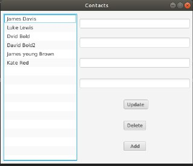
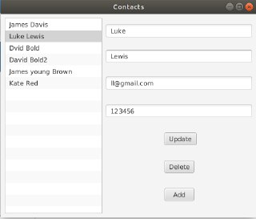
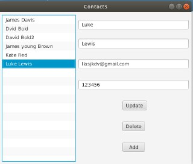
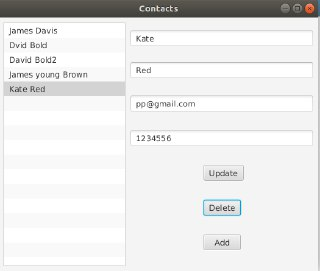
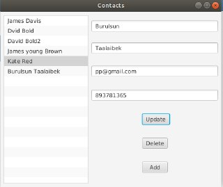

# contact-app

Author Burulsun Taalaibekova

Initial look:

Once you select the contact:

Update the contact's information: (in this case the email was updated)

The updated contact is deleted:

Add new contact:

